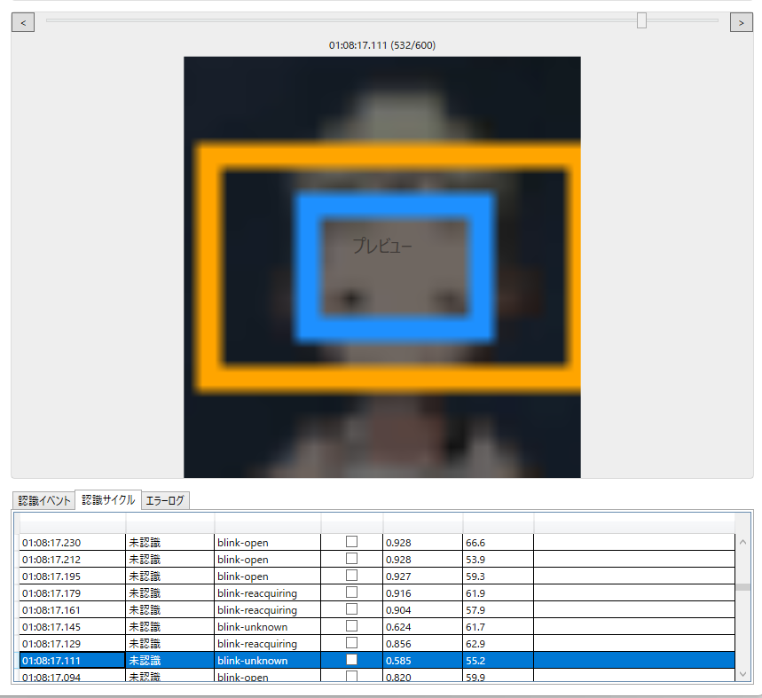
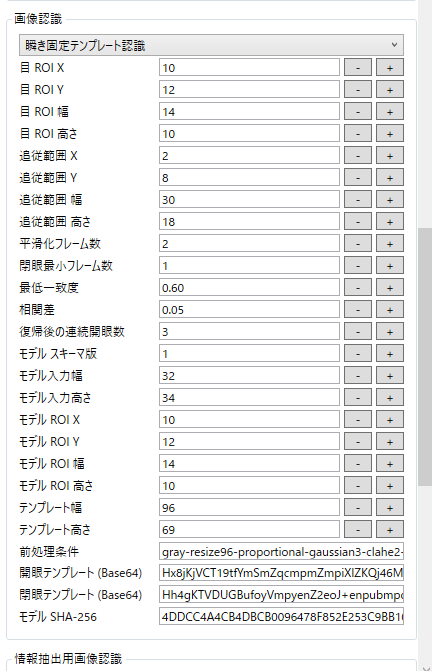
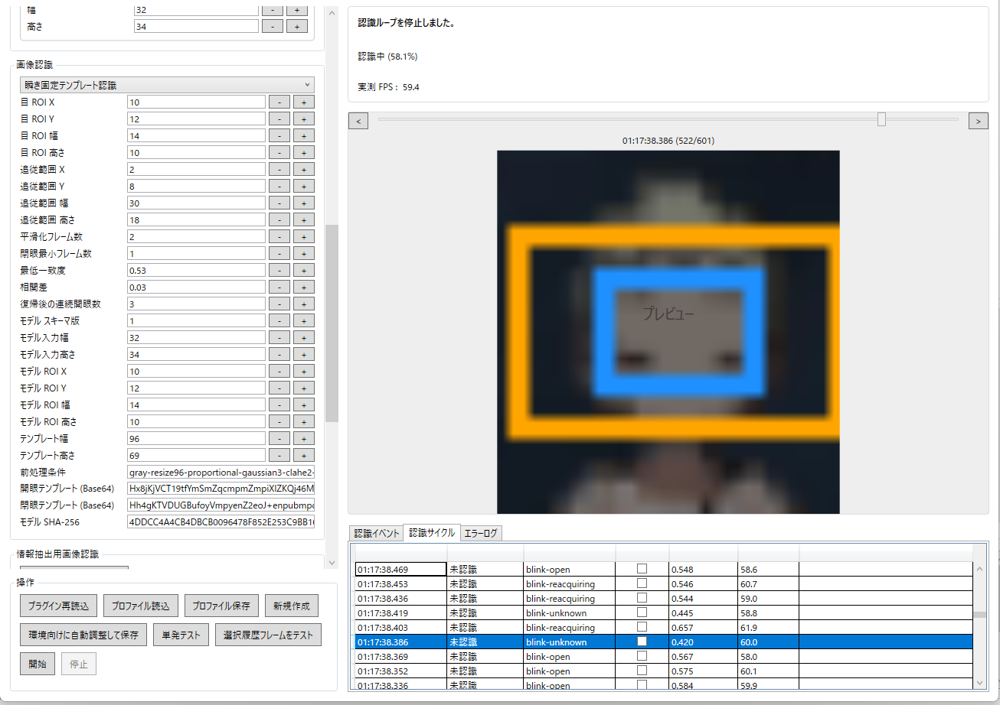

# 固定テンプレート瞬き認識チューニング指針（`blink-unknown` / `blink-reacquiring` 発生時）

## 概要

本ドキュメントは、BlinkObserverTool の **瞬き固定テンプレート認識** で子どもの瞬きなど短い閉眼が安定して検出されず、ログ上で `blink-closed` の代わりに `blink-unknown` や `blink-reacquiring` が記録される場合の調整方針をまとめたものです。  
誤検出を増やさずに検出率を改善するため、**しきい値を下げる前にテンプレート品質と ROI を見直す**ことを標準手順とします。

## 調査事例・スクリーンショット例

### 事例1: `MinimumCorrelation = 0.60`, `MinimumCorrelationMargin = 0.05`

相関値 `0.585` のフレームが `blink-unknown` と判定されており、**最低一致度 `0.60` を下回ったためイベントが抑止**されています。  
同じ事例では、相関値 `0.624` のフレームでも `blink-unknown` が記録されており、この場合は **開眼・閉眼テンプレートの相関差が `0.05` 未満**で、閉眼として確定できなかった可能性が高い状態です。

### 事例2: `MinimumCorrelation = 0.53`, `MinimumCorrelationMargin = 0.03`

相関値 `0.420` と `0.445` が連続して `blink-unknown` となり、その後に `blink-reacquiring`、`blink-open` へ復帰しています。  
この遷移は、**閉眼フレームが閉眼テンプレートへ十分に一致しなかったうえ、`unknown` 発生後の再アーム待ちにも入った**ことを示します。

### 事例3: 細長すぎる ROI (`EyeWidth = 9`, `EyeHeight = 28`, `TemplateHeight = 299`)

添付例のように ROI が **幅 9、高さ 28** の細長い矩形になっている場合、正規化後のテンプレート高さが **299 px** まで伸び、左右 1 px 程度のズレでも相関が落ちやすくなります。  
この状態で `blink-unknown` が `0.299`、`0.334`、`blink-reacquiring` が `0.390`、`0.424` に留まっているなら、**しきい値不足より先に ROI 幅不足とテンプレート採取位置を疑う**のが基本です。

## 添付例のような細長い ROI を直す手順

1. **ROI を手入力で直さず、必ず「瞬き観測セットアップ」をやり直す**  
   固定テンプレート認識では ROI がモデルに焼き付くため、`目 ROI` だけを自動認識設定で直接変更すると学習済み ROI と不一致になります。ROI を変えるときは、セットアップ画面で選び直してから **モデル反映**までやり直してください。
2. **青枠を横に広げ、縦横比を細長くしすぎない**  
   添付例の `9 x 28` は細すぎます。まずは **幅を 14〜18 px、 高さを 28〜32 px 程度**まで広げ、黒い目筋の左右に 2〜4 px、上下に 2〜3 px の余白を含めて採り直してください。  
   目安として、`TemplateHeight` が **250 px を超える**ようなら ROI 幅が狭すぎる可能性が高いです。
3. **開眼・閉眼テンプレートを採り直す**  
   ROI を広げた後、履歴で **最も開いた瞬間**と **最も閉じた瞬間**を選び直します。半目や途中フレームを採ると、しきい値を下げても `blink-unknown` が減りません。
4. **短い瞬き向けに時系列設定を軽くする**  
   細い ROI のケースは瞬きピークが 1 フレームだけになりやすいため、まず **`SmoothingFrames = 1`**、**`RearmOpenFrames = 2`** を試してください。`MinClosedFrames` は **`1` のまま**で構いません。
5. **しきい値は最後に小さく動かす**  
   ROI とテンプレートを採り直しても閉眼相関が少し足りない場合だけ、`MinimumCorrelation` を **`0.38 → 0.36 → 0.34`** のように 0.02 刻みで下げます。`MinimumCorrelationMargin` は **`0.03` を維持**し、必要時のみ **`0.02`** まで下げてください。  
   添付例の `0.299` に合わせて最低一致度を一気に下げるのは非推奨です。そこまで下げると開眼やノイズも通りやすくなります。

## 発生原因と認識器の判定仕様

固定テンプレート認識器は、次の条件で瞬きイベントを抑止します。

1. **`blink-unknown` での抑止**  
   最良相関値が `MinimumCorrelation` を下回る場合、または開眼・閉眼テンプレートの相関差が `MinimumCorrelationMargin` を下回る場合、判定不能として `blink-unknown` を返します。
2. **`blink-reacquiring` での再アーム待ち**  
   `blink-unknown` が出ると認識器は非武装状態へ戻ります。以後は `RearmOpenFrames` 回の連続開眼が確認されるまで `blink-reacquiring` を返し、`blink-closed` を再び発火しません。

そのため、ログが **`blink-unknown` → `blink-reacquiring` → `blink-open`** と流れている場合は、瞬きそのものが無かったのではなく、**閉眼の一致度不足かテンプレート分離不足でイベント条件を満たせなかった**と解釈します。

## 推奨調整手順

調整は、次の順序で実施してください。

1. **開眼・閉眼テンプレートを採り直す**  
   開眼は「完全に開いていてブレていないフレーム」、閉眼は「最も細く潰れた瞬間」を選びます。半目や被写体ブレを含むテンプレートは `blink-unknown` を増やします。
2. **目 ROI を少し広げる**  
   調査時の ROI は `14 x 10` で、まぶたの上下変化を捉えるには小さすぎる可能性があります。特に **上下方向を優先して数ピクセル広げる**ことで、上まぶた・下まぶたの動きを相関に反映しやすくします。
3. **平滑化フレーム数を短くする**  
   短い瞬きを拾いたい場合は `SmoothingFrames = 2` から **`1`** へ下げます。平滑化が強いと、一瞬だけ閉じたピークが平均化されて閉眼相関が弱まります。
4. **再アーム待ちを短くする**  
   `blink-reacquiring` が長引く場合は `RearmOpenFrames = 3` から **`2`** へ下げます。`unknown` 後の復帰が早くなり、次の瞬きを取りこぼしにくくなります。
5. **しきい値を少しだけ緩める**  
   上記を実施しても届かない場合に限り、`MinimumCorrelation` を **`0.53 → 0.48`**、`MinimumCorrelationMargin` を **`0.03 → 0.02`** のように段階的に下げます。変更は小刻みに行い、誤検出の有無を確認してください。

## 運用上の注意

- **`0.42` 付近までの安易なしきい値引き下げは避ける**  
  事例2の `0.420`、`0.445` に合わせてしきい値をそのまま下げると、開眼やノイズでも反応する危険があります。ここまで相関値が落ちる場合は、しきい値よりも **テンプレートの採り方と ROI サイズ**を先に疑ってください。
- **極小 ROI は開閉差を失いやすい**  
  `14 x 10` のような小さな領域では、まぶたの上下動が十分な画素差にならず、開眼・閉眼の相関差が不足しやすくなります。
- **複数項目を同時に大きく変えない**  
  テンプレート、ROI、平滑化、再アーム、しきい値の順で一つずつ変更し、ログ上で `blink-unknown` の減少と `blink-closed` の回復を確認しながら進めてください。
- **固定テンプレート方式では ROI 変更 = 再セットアップ**  
  `EyeWidth` / `EyeHeight` / `EyeX` / `EyeY` を変える場合は、モデル内の ROI も更新する必要があります。自動認識設定で数値だけを直すのではなく、**瞬き観測セットアップから開眼・閉眼の採取までやり直す**運用にしてください。

## 運用メモ

- 子どもの瞬きのように **短く、閉眼ピークが少ないケース**では、まず `SmoothingFrames = 1` と `RearmOpenFrames = 2` を試し、それでも不足する場合にだけしきい値を微調整します。
- 認識率を上げたいときほど、**「閉眼テンプレートをどのフレームから採るか」** が結果に大きく影響します。閾値の調整より先に、履歴スライダーで最も閉じたフレームを厳密に選んでください。
- 調整後は **検証のみモード**で数回の瞬きを観測し、`blink-closed` が発火する一方で、開眼中に誤って検出されないことを確認してから本運用へ戻してください。
