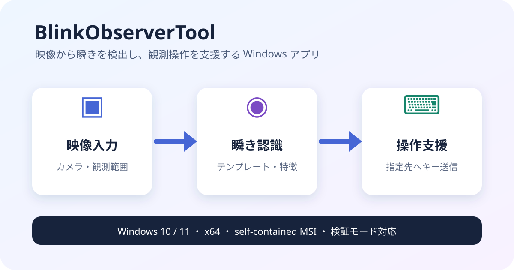

# BlinkObserverTool 製品紹介

BlinkObserverTool は、Windows 上のゲーム映像から瞬きを画像認識し、検出結果に応じて
指定ウィンドウへキー入力を送る観測補助アプリです。テンプレートマッチング、
固定テンプレート瞬き認識、瞬き特徴認識を用途に応じて選択できます。

## 主な機能

- カメラまたは映像入力から観測範囲を指定
- 開眼・閉眼サンプルを使った固定テンプレート認識
- 検出先プロセスと送信キーの保存
- キー送信を行わない検証モードと検出ログ
- 標準プロファイルの安全な追加・更新
- 通常入力と、必要な場合だけ選べる Interception 入力

## 動作環境と配布

| 項目 | 内容 |
|---|---|
| OS | 64 ビット版 Windows 10 / Windows 11 |
| アーキテクチャ | x64 |
| 配布形式 | self-contained MSI |
| 更新 | Windows Installer Major Upgrade |
| 整合性確認 | Release の SHA-256 と `manifest.json` |
| コード署名 | 未署名 |

配布ページは `manifest.json` が指す MSI、SHA-256、タグ、Release URL が同じ
GitHub Release 内で一致した場合だけダウンロードを案内します。MSI は現在未署名のため、
Windows が警告を表示する場合があります。Release ページのタグと SHA-256 を確認して
ください。

## 公開素材

`docs/images/blink-observer-tool-overview.svg` は本リポジトリ用に作成した図であり、
pokenae.com の製品紹介に利用できます。検証用 reference 動画、個人情報を含む画面、
第三者の権利状態が不明な画像は公開素材に含めません。

## 関連情報

- [利用者向けインストーラー導入マニュアル](user-installer-manual.ja.md)
- [固定テンプレート瞬き認識チューニング指針](fixed-template-blink-tuning.ja.md)
- [GitHub Releases](https://github.com/p-o-ke-nae/BlinkObserverTool/releases)
